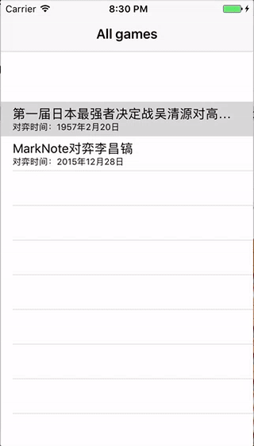

# GoTao
Swift 3 based iOS app to read game records and play the game of Go, also known as Weiqi.

Screenshot:

## Features
- Parse go game records(aka kifu)
- Render moves on GoBan board
- Assign groups
- Calculate liberty and determine life and death 

